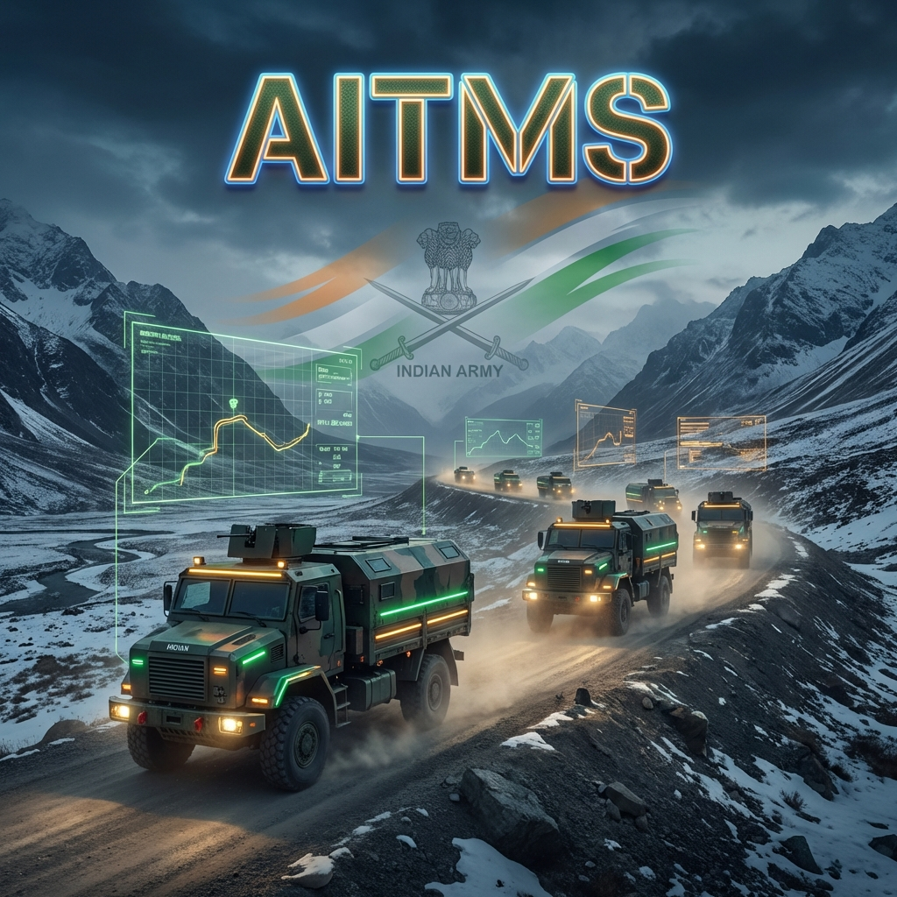
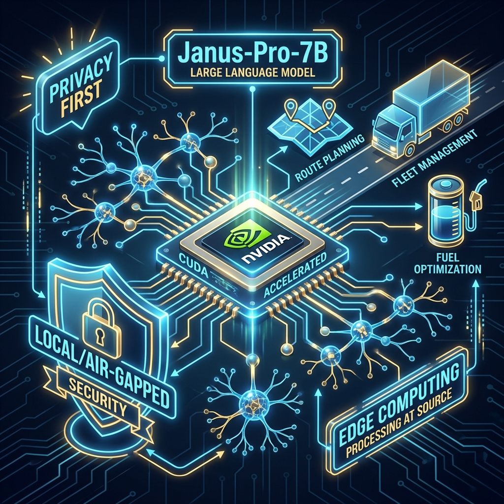

# 🇮🇳 AI Transport Management System (AITMS)
### *Next-Gen Military Logistics | Air-Gapped AI | Physics-First Simulation*

[](https://fastapi.tiangolo.com)
[](https://nextjs.org)
[](https://www.postgresql.org)
[](https://ollama.ai)
[](https://www.docker.com)
[](https://developer.nvidia.com/cuda-zone)

---

## 🚀 Mission Overview

The **AI Transport Management System (AITMS)** is a state-of-the-art **Digital Twin Logistics Platform** designed for the **Indian Army Transport Corps**. It revolutionizes convoy management by integrating **Local LLMs (DeepSeek-Janus)**, **Thermodynamic Vehicle Simulation**, and **Tactical AI Decision Making** into a unified, air-gapped environment.

This system is not just a tracker; it is a **sentient command center** that predicts threats, optimizes fuel efficiency (FOL), and calculates military movement metrics (VTKM) in real-time.

---

## 🧠 Open Source AI Architecture (GPU Accelerated)



AITMS leverages the power of **Edge AI** to ensure data sovereignty and operational security.

- **Model**: `DeepSeek-Janus-Pro-7B` running locally via Ollama.
- **Pipeline**: **"Observer-Thinker-Linker"** Pattern.
    - **Observer**: Ingests real-time telemetry (RPM, Fuel, GPS).
    - **Thinker**: 9-Agent RAG Pipeline (Weather, Threat, Route, Formation).
    - **Linker**: Executes tactical decisions (Reroute, Halt, Evasive Action).
- **Acceleration**: Full CUDA offloading ensures **<500ms inference latency** for critical tactical decisions.

---

## ⚡ Key Capabilities

### 1. Physics-First Digital Twin
A 10Hz physics loop simulating individual vehicle thermodynamics:
- **Engine**: RPM, Temperature, Combustion Efficiency.
- **Environment**: Air Density (Altitude based), Road Gradient, Surface Friction.
- **Consumables**: Real-time FOL (Fuel, Oil, Lubricants) depletion.

### 2. Military Algorithms (Standardized)
- **VTKM (Vehicle Track Kilometer)**: Automated calculation based on convoy size, terrain, and spacing.
- **MACP (Movement Ammunition Credit Point)**: AI-optimized ammo transport credits.
- **TCP Planning**: Automated Traffic Control Point timeline generation.

### 3. Tactical Command Center
- **Threat Detection**: AI analysis of terrain and intel reports to predict Ambush/IED risks.
- **Dynamic Routing**: Multi-agent A* pathfinding with tactical constraints (Avoid Red Zones, Bridge Classes).
- **Load Balancing**: AI distribution of cargo based on vehicle health and capacity.

---

## 🛠️ Technology Stack

| Domain | Technology | Details |
| :--- | :--- | :--- |
| **Frontend** | **Next.js 16** | App Router, React 19, Tailwind CSS v4, Recharts |
| **Backend** | **FastAPI** | Python 3.10, Async SQLAlchemy, Pydantic v2 |
| **Database** | **PostgreSQL** | PostGIS 3.3 for Geospatial Data |
| **State Cache**| **Redis** | High-frequency telemetry caching (10Hz) |
| **AI Engine** | **Ollama** | Local Interface for LLMs |
| **Task Queue** | **Celery** | Asynchronous simulation orchestration |

---

## 📥 Installation

### Prerequisites
- Docker & Docker Compose
- NVIDIA GPU (Recommended) with Drivers
- Ollama installed on host

### Quick Start

1. **Clone the Repository**
   ```bash
   git clone https://github.com/shubro18202758/Indian_Military_Scheduling_System.git
   cd Indian_Military_Scheduling_System
   ```

2. **Initialize AI Model**
   ```bash
   ollama serve
   ollama pull deepseek-janus-pro-7b
   ```

3. **Launch System**
   ```bash
   docker-compose up -d --build
   ```

4. **Access Interfaces**
   - **Command Center**: `http://localhost:3001`
   - **API Docs**: `http://localhost:8001/docs`

---

## 📜 Project Structure

```bash
├── backend/                # FastAPI Application
│   ├── app/services/       # 28+ AI & Domain Services
│   ├── app/models/         # SQLAlchemy Database Models
│   └── app/api/            # REST API Endpoints
├── frontend/               # Next.js Application
│   ├── components/         # 27+ Interactive UI Components
│   └── app/                # App Router Pages
├── docs/                   # Technical Documentation
└── docker-compose.yml      # Container Orchestration
```

---

*Dedicated to the brave men and women of the Indian Armed Forces.* 🇮🇳